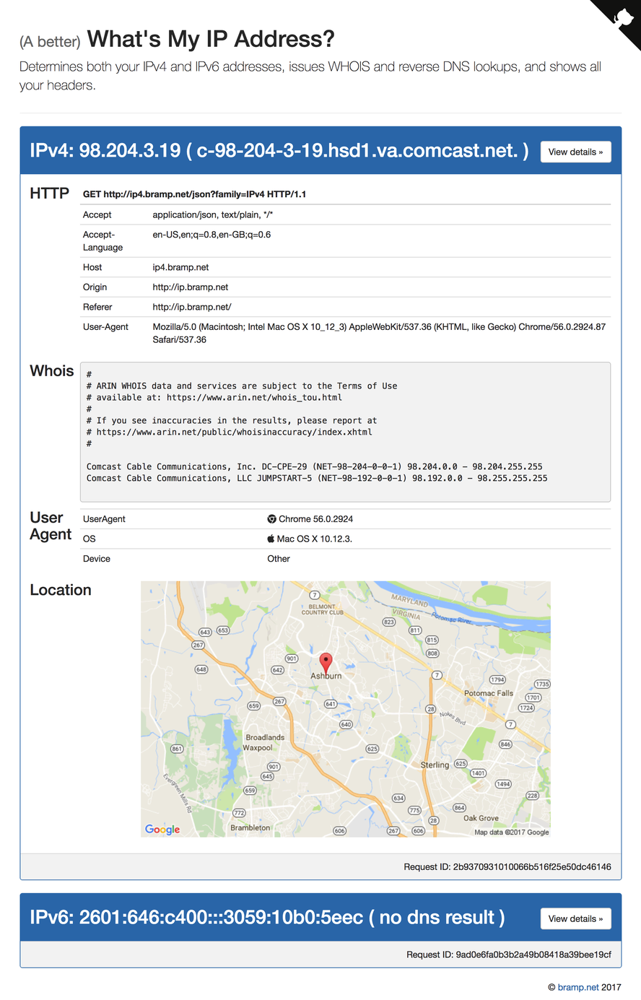

# MyIP [](https://github.com/bramp/myip#licence-apache-2) [](https://travis-ci.org/bramp/myip) [](https://goreportcard.com/report/github.com/bramp/myip)
by Andrew Brampton ([bramp.net](https://bramp.net)) (c) 2017

<!--
Add these when available:
[](https://coveralls.io/github/bramp/myip)
[](https://godoc.org/github.com/bramp/myip)
-->

*(A better)* What's My IP Address web application.
Determines both your IPv4 and IPv6 addresses, issues WHOIS and reverse DNS lookups, and shows all
your HTTP headers.

Check it in action: [ip.bramp.net](https://ip.bramp.net/) or [read about it on my blog](https://blog.bramp.net/post/2017/02/20/building-a-better-whats-my-ip-site/).

[](https://ip.bramp.net/)

This project was quite literally hacked out in one weekend, and was my first App Engine project.

## Install

### Prerequisites

* [App Engine SDK for Go](https://cloud.google.com/appengine/docs/go/download)
* [Make](https://www.gnu.org/software/make/) (which comes on Linux or Mac)
* [npm](https://www.npmjs.com/)

Then run
```bash
make install-tools
```

### Domains

As designed, this Go application will run on the Standard Google App Engine. It requires
two to three host names. One that is IPv4 only, and one that is IPv6 only. In my configuration
I have ip.bramp.net that has both A and AAAA records, ip4.bramp.net that has only A records,
and ip6.bramp.net that only has AAAA records. These all point to the same App Engine instance.

```
$ dig ip.bramp.net 
ip.bramp.net.		300	IN	A	216.239.32.21
ip.bramp.net.		300	IN	AAAA	2001:4860:4802:32::15

$ dig ip4.bramp.net
ip4.bramp.net.		300	IN	A	216.239.32.21

$ dig AAAA ip6.bramp.net
ip6.bramp.net.		300	IN	AAAA	2001:4860:4802:32::15
```

All three domain names should be configured in main.go (find the prodConfig var).

To deploy:
```bash
make deploy
```

## Development

To run locally we use the addresses, [localhost:8080](http://localhost:8080),
[127.0.0.1:8080](http://127.0.0.1:8080), and [http://[::1]:8080](http://[::1]:8080).
The first can be either, and the latter are IPv4 and IPv6 respectively.

To start up a local instance, just execute:
```bash
make serve
```

To test:
```bash
make test
```

### Libraries

To keep libraries up to date run:
```bash
make veryclean
make test
```


## TODO

- [ ] Add rate limiting of requests
- [ ] Add caching of DNS and WHOIS records (including the iana IP ranges)
- [ ] Add configuration file, so can be hosted on different domains
- [ ] Add a favicon.ico
- [ ] Add Make test (which checks with different build tags, e.g macos,appengine linux,appengine)
- [ ] Implement a App Engine Flex, and other PaaS environments
- [ ] Minify all css and js and combine into one file
- [ ] Do better at determining the root cause errors. e.g If both IPv4/IPv6 fail, then perhaps problem with the site. If IPv6 fails after 30 seconds, perhaps problem with IPv6 connectivity.

## Licence (Apache 2)

*This is not an official Google product (experimental or otherwise), it is
just code that happens to be owned by Google.*

```
Copyright 2017 Google Inc. All Rights Reserved.

Licensed under the Apache License, Version 2.0 (the "License");
you may not use this file except in compliance with the License.
You may obtain a copy of the License at

http://www.apache.org/licenses/LICENSE-2.0

Unless required by applicable law or agreed to in writing, software
distributed under the License is distributed on an "AS IS" BASIS,
WITHOUT WARRANTIES OR CONDITIONS OF ANY KIND, either express or implied.
See the License for the specific language governing permissions and
limitations under the License.
```

